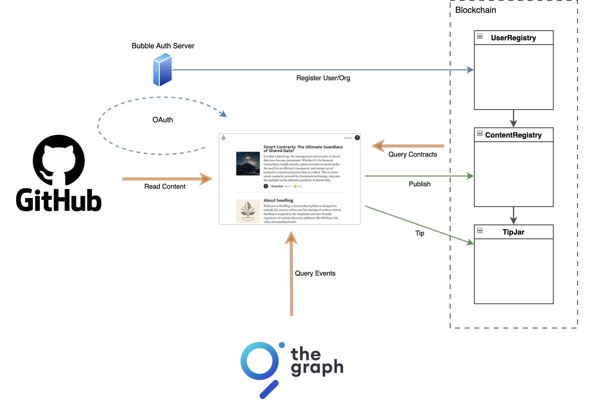

# What Is Seedling?

Seedling is a decentralised platform for publishing, discovering and engaging with written content. It is designed to directly link readers to authors and their content without a central organisation in the middle, creating an open arena for writers and readers to interact, share insights, and reward captivating narratives through cryptocurrency tipping.

For a full description of Seedling, it's features and it's vision, see the [About article](https://seedling-d.app/article/0x3787761e72c5c246e0a296b4704af7db4ab80631465b4eed0e7732eebdf437d6) right here on Seedling.

In this version all content is public, hosted by its author in their account on GitHub.  Content is written in [markdown](https://docs.github.com/en/get-started/writing-on-github/getting-started-with-writing-and-formatting-on-github/basic-writing-and-formatting-syntax) and made discoverable by publishing its url on the blockchain under the author's Seedling account. Seedling's smart contracts ensure that only authors with verified GitHub accounts can publish and take credit for their content.

The Seedling app and smart contracts are open source and available [here](https://github.com/Bubble-Protocol/seedling).

## Creating Your Account

Seedling is free to browse and read content without an account, however if you want to follow users, tip authors or publish content then you will need to at least connect your wallet.  You only need to verify your GitHub account if you want to publish content.

Creating an account is a two step process:

1. **Connect Your Wallet**

    *By connecting a Web3 wallet you will be able to follow users and engage with authors by tipping their content.*
  
    :point_right: Click the 'Connect Wallet' button and follow the instructions to download a wallet and connect to the app. 

2. **Verify Your GitHub Account**

    *By verifying you own a GitHub account you can publish content held in that account.*

    :point_right: Click the *Publish* button on the top of the screen and you will be directed to a login screen.  Click *Connect* and you will be directed to GitHub to connect your account.  Once connected, the *Publish* button will take you to a publish screen.

    *Seedling requests only the most basic access to your public profile so that it can read your GitHub username.*

| :gear: **How It Works** |
|:-|
| *The dapp links your wallet address with your GitHub account by registering them in Seedling's on-chain User Registry. A secure Seedling OAuth server is trusted by the User Registry and communicates with GitHub to handle the connect and registration process. Once registered, you can use your wallet to publish content, held in any of your GitHub repositories, to Seedling's on-chain Content Registry.  The *Content Registry* prevents anyone else from publishing urls from your GitHub account.*|

## Writing Content

Articles on Seedling are written in [GitHub Markdown](https://docs.github.com/en/get-started/writing-on-github/getting-started-with-writing-and-formatting-on-github/basic-writing-and-formatting-syntax) and must be hosted in a public GitHub repository within your GitHub account.

By default, Seedling will attempt to extract the title, description and image from the article content.  However, you can have greater control over these fields and others by including a header within the article.
### Header

To insert a header, place a block at the start of the article surrounded by three dashes `---`.  For example,

```
---
title: Seedling Help
description: How to create your account, publish content and tip authors.
image: ./img/seedling.png
image-caption: Made with Midjourney
image-width: medium
---
```

#### Available fields

| Field | Header Field | Default if not given in the header |
|-------|:------------ |:---------------------------------- |
| Title | `title` | The first H1-level heading within the content |
| Description | `description` | The first paragraph within the content |
| Image URL | `image` | The first image within the content |
| Image Caption | `image-caption` | n/a |
| Image Width | `image-width` * | `default` (same width as text content) |

\* `image-width` can be `full`, `medium` or `default`.


### Relative Links

Any relative links within your markdown will be expanded relative to the published url on `https://github.com`.
## Publishing Content

Content on Seedling is hosted on [GitHub](https://github.com), from a public repository in your GitHub account. This gives you full ownership and control of your content.

To publish content on Seedling you must have verified ownership of your GitHub account.  See [Creating Your Account](#creating-your-account) above.  You can only publish content hosted in your own GitHub account or from a GitHub organisation you are an administrator of.

Publishing requires a blockchain transaction from your wallet, so you will need a small amount of funds in your wallet account.  Seedling does not charge a fee for publishing content.

### How To Publish

1. **Commit Your Content** in a ***public*** repository in your GitHub account.

2. **Click the *Publish* Button** to open the publish page.

3. **Copy & Paste Your Content URL** from GitHub to the publish page. Seedling will accept the URL of the content's main page or its raw URL link.

4. **Click Publish** to use your wallet to publish your content URL to the blockchain.  Optionally use the *Preview* button to see how your content will look before publishing. 

It may take a few minutes before your published content is visible in the app.
 
| :gear: **How It Works** |
|:-|
| *Your content URL is published to Seedling's on-chain Content Registry, a smart contract that confirms you are the registered owner of the GitHub account in the URL and that neither the content nor URL has been previously published, before recording your publication on the blockchain. Your publication record is an event consisting of the keccak256 hash of your content, the content URL and your author id. The Seedling app uses [The Graph Network](https://thegraph.com) to query and discover content records and loads the content itself from GitHub when you view it.* |

### Updating Published Content

The Seedling app reads content directly from GitHub whenever it is viewed. This means any updates to your content in GitHub will be authomatically available to readers without needing to republish the content URL.

## Sharing Content

All content on Seedling is public and can be read by anyone, without a wallet or GitHub account.  When viewing an article, use the share link in the activity bar to copy the content's URL.  Use the *more* button to copy the content's GitHub links.

## Following Authors

Any user who has published content can be followed.  Use the **Follow** link when viewing an article to follow its author.  Follows are not published to the blockchain or made public in any way so remain private to you.


| :gear: **How It Works** |
|:-|
| *Follows are saved to local storage in your browser.* |

## Tipping

To show appreciation for content and reward its author, readers can tip an article by clicking the  symbol wherever it is found. Next to the symbol is a number representing the total amount of tipped ETH the article has received (displayed in mETH).

Tips are made from the reader's wallet in the blockchain's native ETH currency and are sent to the wallet account of the content's registered author, minus a small platform fee of 10%.

As an author, anytime a reader tips your content your registered wallet account will be automatically credited.

| :gear: **How It Works** |
|:-|
| *Tips are sent to Seedling's on-chain TipJar smart contract, which identifies the content's registered author and forwards the tip to their wallet account, minus the platform fee.* |

# Architectural Overview



# More Information

For more information, questions, feedback or suggestions, feel free to contact us on the [Bubble Protocol Discord server](https://discord.gg/sSnvK5C) or at support@seedling-d.app.

Happy reading and writing on Seedling!

_Last updated: 4-Dec-2023_


